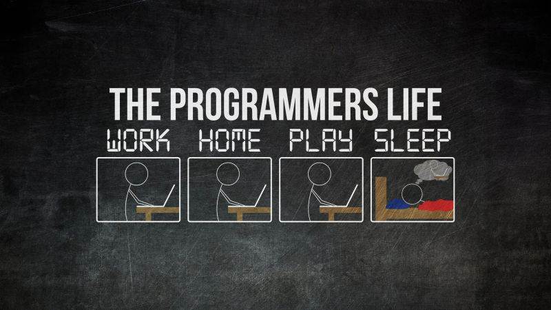

  

<h1 align="center">👋 Welcome to Amir Hossein's GitHub Universe</h1>
<h3 align="center">Python Developer | Machine Learning Explorer | SQL & Database Enthusiast</h3>

---

## 🌟 About Me
Hi there! I’m **Amir Hossein Heydari**.  
I see **data as a language**, and I love turning numbers into insights and building intelligent systems.  

🔭 Currently working on:  
- Developing **ML models** that actually *work*  
- Enhancing **SQL & Database skills** with real projects
- Exploring AI & Data Analytics  

🌱 Always learning, always curious, always building.

💬 Fun Fact: I love combining **code, data, and creativity** to make projects visually appealing and meaningful.

---

## 🛠️ Tech Stack & Tools

  
  
  
  
  
  
  
  
  

---

## 📊 GitHub Stats

  
  

---

## 💡 Quote of the Day
> “Every dataset hides a story — and I’m here to uncover it.”  

---

## 📬 Connect With Me

  
  
  

---

## 🚀 Fun Stuff / Extras

- ⚡ I love **building interactive projects** with Python & SQL  
- 🎨 Sometimes I make **visual dashboards** for data insights  
- 🏆 Goal: Make **every project look professional & fun**  
- 💡 Motto: *“Code smart, learn faster, build cooler.”*

---

  

---

⭐️ **Thanks for visiting! Feel free to explore my repositories and connect with me!**
